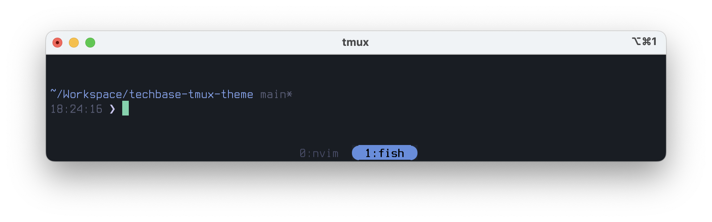
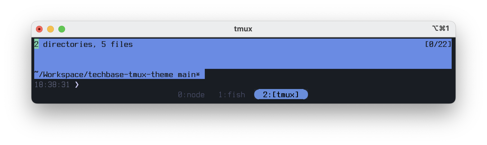
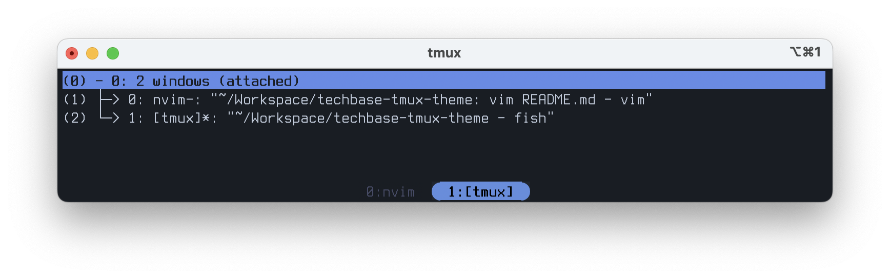

# techbase-tmux-theme

A dark and cold tmux color scheme inspired by techbase-style Doom maps, 1990's
technology and conceptions of future technologies, and sci-fi horror. This is a
port of [techbase.nvim](https://github.com/mcauley-penney/techbase.nvim) for
tmux.

## Preview

  

## Installation

### Using TPM (Tmux Plugin Manager)

Add this line to your `~/.tmux.conf`:

```bash
set -g @plugin 'akmalsoliev/techbase-tmux-theme'
```

Then press `prefix + I` (capital i, as in Install) to install the theme.

### Manual Installation

**NOTE**: The assumption is that `tmux.config` is placed in `~/.tmux.conf`

1. Clone this repository:

   ```bash
   git clone https://github.com/akmalsoliev/techbase-tmux-theme.git
   ~/.config/tmux/plugins/techbase-tmux-theme
   ```

2. Source the theme in your `~/.tmux.conf`:

   ```
   source ~/.config/tmux/plugins/techbase-tmux-theme/techbase.tmux
   ```

3. Reload tmux configuration:
   ```bash
   tmux source-file ~/.tmux.conf
   ```

## Color Palette

The theme uses the following color variables:

| Element        | Color           | Hex       |
| -------------- | --------------- | --------- |
| Foreground     | Light Blue-Grey | `#CCD5E5` |
| Background     | Dark Grey       | `#191d23` |
| Background Alt | Darker Grey     | `#20252E` |
| Comment        | Muted Purple    | `#474B65` |
| Accent         | Blue            | `#6A8BE3` |
| Number         | Rust Red        | `#B85B53` |
| Operator       | Tan             | `#b09884` |

## Features

- **Status bar styling** with techbase color scheme
- **Active/inactive window differentiation** with accent colors
- **Pane border styling** that highlights the active pane
- **Message and command styling** for copy mode and prompts
- **Clock mode** with themed colors
- **Bell notifications** with alert coloring
- **True Color support** for terminals that support it

## Related Projects

- [techbase.nvim](https://github.com/mcauley-penney/techbase.nvim) - The
  original Neovim color scheme
- Kitty and iTerm2 configurations are also available in the original repository

## License

This project follows the same license as the original techbase.nvim theme.

## Contributing

Issues and pull requests are welcome! Please feel free to contribute
improvements or report any problems.
